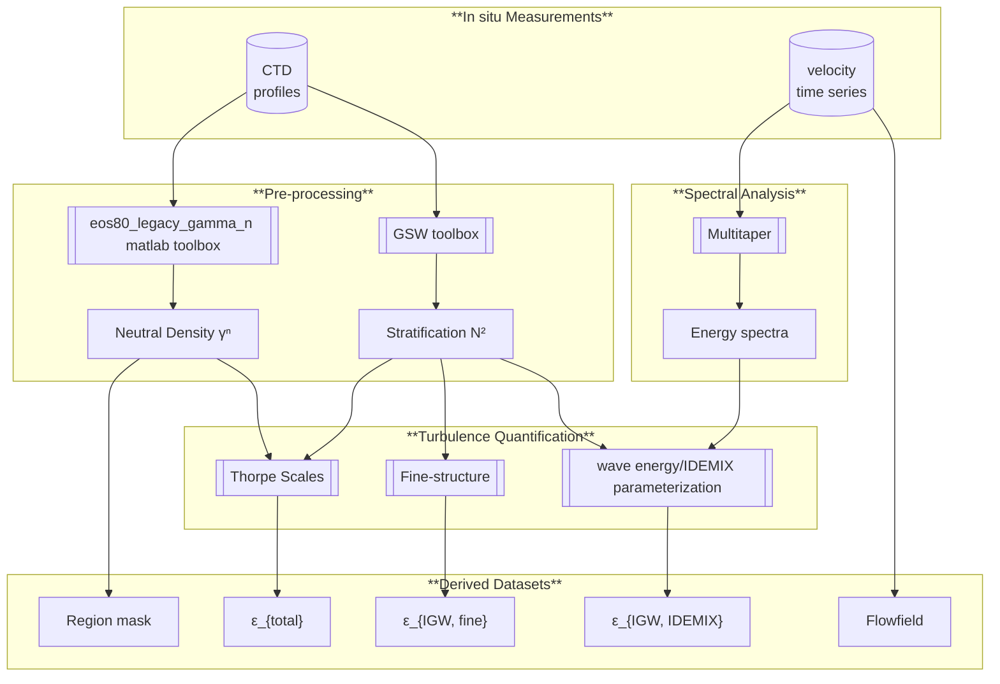

  

## Analysis code to the publication: 
# [Pinner et al., 2025](https://doi.org/10.5194/os-21-701-2025)
# [*Internal-wave-induced dissipation rates   in the Weddell Sea Bottom Water gravity current*](https://doi.org/10.5194/os-21-701-2025)

The Weddell Sea Bottom Water gravity current transports dense water from the continental shelf to the deep sea and is crucial for the formation of new deep-sea water. Building on vertical profiles and time series measured in the northwestern Weddell Sea, we apply three methods to distinguish turbulence caused by internal waves from that by other sources. We find that in the upper part of the gravity current, internal waves are important for the mixing of less dense water down into the current.

## Derived Quantities
The most important derived quantities are 3 transects across the continental slope of near-bottom dissipation rates:

- **Total dissipation rate** $\pmb{\varepsilon}_\textbf{total, Thorpe}$  
Derived from CTD profiles and the Thorpe scale approach

- **Wave-induced dissipation rate** $\pmb{\varepsilon}_\textbf{IGW, fine}$  
Derived from CTD profiles and the strain-based finestructure method

- **Wave-induced dissipation rate** $\pmb{\varepsilon}_\textbf{IGW, IDEMIX}$  
Derived from velocity timeseries and parameterization from squared wave energy.

All data sets are saved as `.csv` files in the `derived_data` folder, with the vertical coordinate `meters above the seafloor` and horizontal coordinate `longitude`. Examples of use are shown in `derived_data/examples.ipynb`. 

## Reproducibility

Reproducing these works is unfortunately not straight forward, depending on your expertise. Multiple intermediate steps are needed to go from raw data to results. For example, I used a Matlab script to calculate neutral densities for all CTD profiles. Additionally, some of data files are not read in as `.csv` but as `.mat` files, due to early collaboration in the analysis. PS129 data is of right now unpublished and not yet converted into a neatly organized data set. 

The high-level requirements are given in `requirements.txt`, with my complete python enviroment detailed in `enviroment.yaml`, and can be reinstalled by the installer/enviroment manager of your choice (pip, conda, etc.), for example by `conda create --file requirements.txt`.

## Disclaimer
> [!IMPORTANT]  
> - Although this code produces the results and figures to the accompanying paper, this repository occasionally contains unused code snippets and partial documentation. 
> - Comments or corrections to the code can be given on GitHub as issues.  
> - Note that figures created here can differ slightly from the published versions, as some post-processing (adjustements and labeling) were made with *Inkscape*. 
